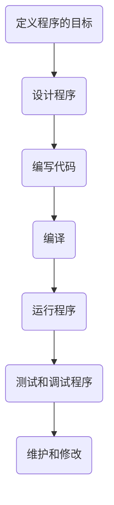
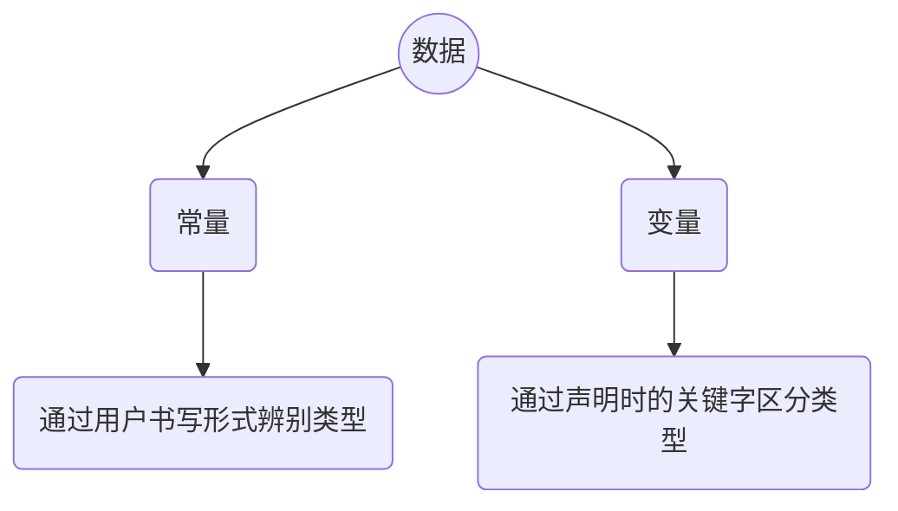

## 一、初识C语言

##### 1.6.1第一个ANSI/ISO C标准/或叫做C89标准

在该委员会制定的指导原则中，最有趣的可能是：保持 ==C的精神==。委员 会在表述这一精神时列出了以下几点： 

信任程序员； 

不要妨碍程序员做需要做的事；  

保持语言精练简单；

只提供一种方法执行一项操作；

让程序运行更快，即使不能保证其可移植性。

##### 1.6.2C99标准

### 1.7使用C语言的7个步骤



##### 1.7.1第1步：定义程序的目标

程序实现自己的什么目标？

程序需要什么信息？

程序需要报告什么信息？

（此步不涉及具体的计算机语言）

##### 1.7.2第2步：设计程序

用户界面应该是什么样的？

如何组织程序？
目标用户是谁？

准备花多久完成？

如何表示和处理数据？

（不涉及计算机语言）

##### 1.7.3第3步：编写代码

举例

```c
#include <stdio.h>
int main(void)
{
    int dogs;//定义整数型变量
    printf("How many dogs do you have?\n");//输出字符串
    scanf("%d",&dogs);//用户格式化输入
    printf("So you have %d dog(s)!\n",dogs);//输出结果
    return 0;
}
```

==在编写代码中为自己的程序添加文字注释是很好的习惯==

##### 1.7.4第4步：编译

编译的细节取决于编译器和编译环境

编译器是把源代码转换成可执行代码的程序。可执行代码是用计算机的机器语言表示的代码，这种语言由数字码表示的指令组成。编译的最终结果是生成一个用户可以运行的可执行文件。

编译器具有检查功能，如果C编译器发现错误，就不生成可执行文件并报错。

##### 1.7.5第5步：运行程序

常见的环境，Windows命令提示符模式、UNIX终端模式和Linux终端模式

##### 1.7.6第6步：测试和调试程序

##### 1.7.7第7步：维护和修改代码

### 1.8编程机制

 ```mermaid
 graph LR
 code1(源代码.c)-->code2((编译器))-->code3(目标代码.obj)-->code4((链接器))-->code5(可执行代码.exe);
 code6(库代码)-->code4;
 code7(启动代码)-->code4;
 ```

源代码被编译器转换为目标代码，目标代码是一种机器语言代码，但是不能够直接运行，因为不是一个完整的程序

目标代码缺失启动代码，启动代码充当着程序和操作系统之间的接口，不同系统的启动代码不一样

目标代码还缺失库函数，因为所有的C程序都要用到C标准库里的函数，而目标代码只包含了使用函数的指令，函数真正的代码储存在库里

链接器把目标代码、系统的标准启动代码和库代码三部分合并为可执行文件。对于库函数，==链接器只会把程序需要用到的库函数提取出来==

### 1.12复习题

1.对编程而言，可移植性意味着什么？

完美的可移植程序是，其源代码无需任何修改就能在不同计算机系统中成功编译的程序

2.解释源代码文件、目标代码文件和可执行文件有什么区别？

源代码文件包含程序员使用的任何编程语言编写的代码。目标代码文件包含机器语言代码，它不必是完整的程序代码（缺少库代码和启动代码）。可执行文件包含组成可执行程序的完整机器语言代码。

3.编程的7个主要步骤是什么？

定义程序目标；设计程序；编写程序；编译程序；运行程序；测试和调试程序；维护和修改程序

4.编译器的任务是什么？

编译器把源代码翻译成等价的机器语言（又称为目标代码）

5.链接器的任务是什么？

链接器把编译器翻译好的源代码以及库代码和启动代码组合起来，生成一个可执行程序

# 二、C语言概述

##### 2.2.1程序举例和快速概要

```C
#include<stdio.h>				
	/*包含另一个文件，该行告诉编译器把stdio.h中的内容包含在当前程序中，stdio.h是C编译器软件包的标准部分，它提供键盘输入和屏幕输出的支持*/
int main(void)					//函数名
{								//函数体开始
	int num;					//声明
    num=1;						//赋值表达语句
    printf("I am a simple");	//调用函数
    printf("computer.\n");		//调用另一个函数
    printf("My favorite number is %d because it is first.\n",num);				
    /*%d告诉计算机以何种形式输出num的值，打印在何处*/
    return 0;					
    /*return语句，C函数可以给调用方提供（或返回）一个数。目前可暂时把该行看作是结束main()函数的要求*/
    
}
```

##### 2.2.2程序细节

1.#include指令和头文件


#include<stdio.h>的作用相当于把stdio.h文件种所有内容都输入该行所在位置。实际上是一种“==拷贝-粘贴==”的操作

#include是一条C预处理指令，#符号表明C预处理器在编译器接手之前处理这条指令


2.main()函数


int main(void);

int是main()函数的返回类型。表明main() 函数返回到操作系统的值是整数。


3.注释

```c
/*这是一条C注释*/
//这是一条C注释，但只能注释一行
```

4.花括号、函数体和块

```c
{//花括号的左边标记了函数体的开始
    
}//花括号的右边标记了函数体的结束

/*花括号还可以用于把函数种的多条语句合并为一个单元或块，在Pascal、ADA、Modula-2或者Algol中，花括号在C语言中的作用类似这些语言中的begin和end

```

5.声明

int num；

声明(declaration)是C语言最重要的特性之一。

一、在函数中有个名为num的变量（variable）

二、int表明 num是一个整数

三、==分号在C语言中是大部分语句和声明的一部分==，不像在Pascal中只是语句间的分隔符 

int作为C语言的一个关键字（keyword），表示一种基本的C语言数据类型。关键字不可作为函数名和变量名

num是一个标识符（identifier），也就是一个变量、函数或其他实体的名称。

声明的作用就是把特定标识符与计算机内存中的特定位置联系起来，同时明确了储存在某位置的信息类型或数据类型。

未经声明的变量是不可使用的


==标识符的命名==

```c
//标识符必须由大小写字母、数字和下划线来命名，且第一个字符必须是字母或者下划线，不能是数字
//操作系统和C库经常使用一个或两个下划线字符开始的标识符(如_kcab)
```

6.赋值

num=1；

7.printf()函数

```c
printf("I am a simple ");
printf("computer.\n");
printf("My favorite number is %d because it is first.\n", num);
```


圆括号表示printf是一个函数名。圆括号的内容的从main()函数传递给printf()函数的信息。例如，上面的第1行把I am simple传递给printf()函数。

这个信息被成为参数，更确切说是函数的实际参数（actual argument）

\n(newline character)是一个转义序列(escape sequence)。转义序列用于代表难以表示或无法输入的字符。如\t代表Tab键，\b代表Backspace键

%d是占位符，其作用是指明num值的位置

8.return语句

### 2.3简单程序的结构

函数由函数头和函数体组成

<center>函数头</center>

```c
int main(void)
```

<center>函数体</center>

```c
{
	int q;//声明
    q=1;//语句
    printf("%d is neat.\n",q);//语句
    return 0;
}
```

### 2.4提高程序可读性的技巧

1.选择有意义的函数名

2.写注释

3.在函数中用==空行分隔概念上的多个部分==

4.每条语句各站一行

实例

 ```c
 #include<stdio.h>
 int main(void)/*把2音寻（测水深的单位）转换为英尺-写注释*/
 {
     int feet,fathoms;//使用有意义的变量名
     				//使用空行分隔不同概念部分
     fathoms=2;		
     feet=6*fathoms;//每行一条语句
     printf("There are %d feet in %d fathoms!\n",feet,fathoms);
     return 0;
 }
 ```

### 2.5进一步使用C

```c
#include<stdio.h>
int main(void)
{
    int feet,fathoms;
    
    fathoms=2;
    feet=6*fathoms;
    
    printf("There are %d feet in %d fathoms.\n",feet,fathoms);
    printf("Yes,I said %d feet!\n",6*fathoms);
    
    return 0;
}
```

### 2.6多个函数

```c
#include <stdio.h>
void butler(void);//函数原型prototype
int main(void)
{
    printf("I will summon the butler function.\n");
    butler();	//函数调用function call
    printf("Yes,Bring me some tea and writeable DVDS.\n");
    return 0;
}
void butler(void)//函数定义function definition
{
    printf("You rang,sir\n");
}
```

函数原型是一种声明形式，告知编译器正在使用某函数，因此函数原型也被成为函数声明。同时函数原型指明了函数的属性

无论main()在程序文件处于什么位置，所有的C程序都从main()开始执行。

C标准建议，要为程序中用到的所有函数提供函数原型。标准include文件为标准函数提供了函数原型

### 2.7调试程序

程序的错误通常叫做bug，找出并修正错误的过程叫做调试(debug)

#### 2.7.1语法错误

不遵循C语言的规则就会犯语法错误

#### 2.7.2语义错误

语义错误是指意思上的错误

scornful derivatives sing greenly（轻蔑的衍生物不熟练地唱歌）

```c
int n,n2,n3;
n2=n*n;
n3=n2*n2;
```


句中的形容词、名词、动词和副词都在正确的位置上，就像代码中的语法都是正确的，但是表意不详，让人不知所云。编译器无法检测语义错误

#### 2.7.3程序状态（debug的方法）

通过逐步跟踪程序的执行步骤，并记录每个变量，便可监视程序的状态。程序状态是在程序执行过程中，某给定点上所有变量值的集合

1.模拟计算机逐步执行程序，但如果程序中循环过多的话，可以跟踪一部分循环来验证

2.定位语义错误的另一种方法是：在程序中的关键点插入额外的printf()语句，以监视定变量值的变化。

3.检测程序状态的第三种方法是使用调试器(debugger)

### 2.8关键字和保留标识符

关键字和保留标识符不能用作当为标识符来用

### 2.9关键概念

对于和人之间的交流，用错几个单词，犯一两个语法错误，或者说几句不完整的句子，别人可能根据语境和你的语气等能明白你的表达和需要。

而编译器不允许如此，对它而言，它不懂得自我思考，==几乎正确然然是错误==

**如何理解C语言？**

可以把C程序看作是希望计算机如何完成任务的描述。编译器负责处理一些细节工作，例如把你要计算机完成的任务转换成底层的机器语言（如果从量化的方面来解释编译器所做的工作，它可以把1KB的源文件创建成60KB的可执行文件；即使是一个很简单的C程序也要用大量的机器语言来表示）由于编译器不具有真正的智能，所以你必须用编译器能理解的术语表达你的意图，这些术语就是C语言标准规定的形式规则。

### 2.11复习题

1.C语言的基本模块是什么？

函数

4修改程序

```c
include studio.h//include<stdio.h>
int main{void}//int main(void)
(			//改用花括号
int s		//缺少分号
s := 56;	//多了一个冒号,且一年有52周而不是56
printf(There are s weeks in a year.);/*首先printf函数里的字符串应该使用双引号，其次引用变量当作打印应该使用占位符(这里应使用%d)，然后在字符串后面引用变量，而且最好加上换行符。
修改过后正确的语句为printf("There are %d weeks in a year.\n",s);*/
return 0;
)
```

6.在main、int、function、char、=中，哪些是C语言的关键字

int 、char

7.如何以下面的格式输出变量word和lines的值（这里3020和350代表两个变量的值）？

There were 3020 words and 350 lines

```c
#include<stdio.h>
int main(void)
{
    int word,lines;
 
    word=3020;
    lines=350;
    printf("There were %d words and %d lines.\n",word,lines);
    
    return 0;
    
}
```

8.考虑下面的程序：

```c
#include<stdio.h>
int main(void)
{
    int a,b;
    a = 5;
    b = 2;/*第七行*/
    b = a;/*第八行*/
    a = b;/*第九行*/
    printf("%d %d\n",b,a);
    return 0;
}
```

请问，在执行完第七行、第八行、第九行后，程序的状态分别是什么？

第七行后：a=5，b=2

第八行后：a=5，b=5

第九行后：a=5，b=5

9.考虑下面的程序

```c
#include<stdio.h>
int main(void)
{
    int x,y;
    x=10;
    y=5;//第七行
    y=x+y;//第八行
    x=x*y;//第九行
    printf("%d %d\n",x,y);
    
	return 0;
}
```

请问，在执行完第七行、第八行、第九行后，程序的状态分别是什么？

第七行后：x=10，y=5

第八行后：x=10，y=15

第九行后：x=150，y=15

# 三、数据和C

3.1示例程序

```C
/*platinum.c--your weight in platinum*/
#include <stdio.h>
int main(void)
{
    float weight;//你的体重
    float value;//相等重量的白金价值
    printf("Are you worth your weight in platinum?\n");
    printf("Let's check it out.\n");
    printf("Please enter your weight in pounds:");
    scanf("%f",&weight);//获取用户的输入
    /*假设白金的价格是每盎司$1700*/
    value=1700.0*weight*14.5833;
    /*14.5833用于把英镑常衡盎司转换为金衡盎司*/
    printf("Your weight in platinum is worth $%.2f.\n",value);
    printf("You are easily worth that!If platinum prices drop,\n");
    printf("eat more to maintain your value.\n");
    
    return 0;
    
}
```

### 3.2 变量、常量与数据

程序想要完成任务九需要使用==数据，即承载信息的数字和字符==有些数据类型在程序使用之前已经预先设定好了，在整个程序的运行过程中没有变化，这些称为常量(constant)。其他数据类型在程序运行期间可能会改变或被赋值，这些称为变量(variable)

### **3.3数据：数据类型关键字**

不同数据类型之间有差异。一些数据类型表示数字，一些数据类型表示字母(更普遍地说是字符)。C通过识别一些基本的数据类型来区分和使用这些不同的数据类型：

如果数据是常量，编译器通过用户书写的形式来识别(如42是整数，42.100是浮点数)



对于变量来讲，要在声明时指定其类型如int、float等

|           | C语言的数据类型关键字 |                 |
| --------- | :-------------------: | --------------- |
| 最初K&R   |    C90标准的关键字    | C99标准的关键字 |
| int       |        signed         | _Bool           |
| long      |         void          | _Complex        |
| short     |                       | _Imaginary      |
| unsingned |                       |                 |
| char      |                       |                 |
| float     |                       |                 |
| double    |                       |                 |
|           |                       |                 |

int关键字用来表示基本的整数类型。后三个关键字(long、short和unsigned)和C90新增signed用于提供基本整数类型的变式，例如unsigned shor int和long long int。char关键字用于指定字母和其他字符，另外char类型也可表示较小的整数。float、double和long double表示带小数点的数。Bool类型表示布尔值[*(true或false)*]()，complex和_Imaginary分别表示复数和虚数。

由这些关键字创建的类型，按计算机的储存方式可分为两大基本类型：整数和浮点数类型

位(bit):最小的储存单元，可以储存0或1

字节(byte):常用的计算机储存单位，1字节为8位

字(word):设定计算机时给定的自然存储单位。最直观体现在个人计算机的操作系统的字长位数

##### 3.3.1整数和浮点数

整数没有小数部分，浮点数有小数部分

### 3.4 int类型

一般系统用一个特殊位的值来表示有符号整数的正负号

#### 3.4.1int类型

**1声明**

```C
int erns;				// 声明变量
int hogs,cows,goats;	//声明多个变量
```

**2三种不同的赋值**

**赋值**

 ```c
 cows=112;
 ```

**通过函数赋值**

```c
scanf("%d",&cows);
```

**初始化**

初始化(initialize)变量就是为变量赋一个初始值。在C语言中，初始化可以直接在声明中完成。

```c
int hogs=21;			//初始化变量
int cows=32,goats=14;	//初始化多个变量
int dogs，cats=94;/*有效，但是格式糟糕，只初始化了cats，没有初始化dogs*/
```

**5八进制和十六进制**

通常C语言都假定整型常量是十进制数。然而，许多程序员很喜欢使用八进制和十六进制数

十六进制数的每一位的数恰好由4位二进制数表示。例如十六进制数3是0011，十六进制数5是0101，因此十六进制数35的位组合是00110101，十六进制53的位组合是01010011，这种关系使得十六进制和二进制的转换十分方便。

在C语言中，使用特定的前缀表示使用哪种进制，==0x或0X前缀表示十六进制值，所以十进制数16表示成十六进制是0x10或0X10；0前缀表示八进制，如十进制16表示成八进制是020==

明确一点，使用不同的进制是为了方便，而不会影响数被储存的方式，因为计算机内部都以二进制进行编码

**6显示八进制和十六进制**

|          | 十进制 | 八进制 | 十六进制 |
| -------- | ------ | ------ | -------- |
| 占位符   | %d     | %o     | %x       |
| 显示前缀 | %#d    | %#o    | %#x      |

程序清单3.3==base.c实例==

```c
/*bases.c--以十进制、八进制、十六进制打印十进制数100*/
#include<stdio.h>
int main(void)
{
    int x=100;
    printf("dec=%d;octal=%o;hex=%x\n",x,x,x);
    printf("dec=%#d;octal=%#o;hex=%#x\n",x,x,x);
    
    return 0;
}
```

结果为：

dec=100;octal=144;hex=64
dec=100;octal=0144;hex=0x64


#### 3.4.2其他整数类型

##### 1声明int型变量(关键字)

C语言提供3个附属关键字修饰基本整数类型：short、long和unsigned

short int类型（或者简写为short）占用的存储空间可能比int类型少，常用于较小数值的场合以节省空间。与int类似，short是有符号类型

long int或long占用的存储空间可能比int多，适用于较大数值场合。与int类似，long是有符号类型

long long int或long long（C99标准加入）占用的存储空间可能比long多，适用于更大数值的场合。该类型至少占64位。与int类似，long long是有符号类型

unsigned int或unsigned 只用于非负值的场合。这种类型与有符号类型表示的范围不同。例如，16位unsigned int允许取值的范围是0~65535，而不是-32768~32767.用于表示正负号的位现在用于表示另一个二进制位，所以无符号整型可以表示更大的数。

在C90标准中，添加了unsigned long int或unsigned long和unsigned int或unsigned short类型。

C99标准添加了unsigned long long int或unsigned long long

在任何有符号类型前面添加关键字signed，可强调使用有符号的意图，例如short、short int、signed short、signed short int都表示同一种类型

##### 2各类型变量占位和范围

```C
C语言中
1、在32位系统中：
char（1）字节
short（2）字节
int（2）字节
long（4）字节
char*（4）字节
int*（4）字节
int**(4)字节
    
2、在64位系统中：
char（1）字节
short（2）字节
int（4）字节 -2147483648~2147483647（-2^31~2^31-1)
unsigned int(4)字节0~4294967295
long（8）字节 或（4）字节(跟编译器有关)
unsigned long(4)字节0～4294967295
char*（4）字节
int*（4）字节
int**(4)字节
```

==在一些C标准函数中，要求使用long类型的值，要把一个较小的常量作为long类型来对待，l或L可用于表示long常量，ll或LL可用于表示long long常量，u或U可以表示unsigned long long，如5ull，10LLU，9ULL==

##### 3整数溢出

```C
/*toobig.c--超出系统允许的最大int值*/
#include<stdio.h>
int main(void)
{
    int i = 2147483647;			//int（4）字节-2147483648~2147483647（-2^31~2^31-1)
    unsigned int j = 4294967295;//unsigned int(4)字节0~4294967295
    
    printf("%d %d %d\n",i,i+1,i+2);
    printf("%d %d %d\n",j,j+1,j+2);//devc里面不支持unsigned
    
    return 0;
    
}
```

```C
2147483647 -2147483648 -2147483647
4294967295 0 1
--------------------------------
Process exited after 0.03176 seconds with return value 0
请按任意键继续. . .
```

可以把无符号整数j看作是汽车的里程表，当达到它所能表示的最大值时，会重新从起点0开始；整数i也一样，但是有符号整数的起点是-2147483648

##### 4*printf打印占位符类型

程序清单3.4print1.占位符程序

```c
#include<stdio.h>

int main(int argc,char const *argv[])
{
	int a=12,b=-20;//默认10进制赋值
    printf("a+b=%d\n",a+b);
    //1、%d为整数占位符，10进制表示，默认有符号，占4字节
    printf("无符号打印b=%u\n",b);
    //2、%u为整数占位符，10进制表示，无符号表示，最高位算作值
    printf("a=%d,8进制为%o\n",a,a);
    //3、%o为整数占位符，8进制表示
    printf("a=%d,16进制为%x\n",a,a);
    //4、%x为整数占位符，16进制表示
    
    float c=12.5,d=3.1415e5;
    printf("c+d=%f\n",c+d);
    //5、%f为浮点数占位符
    printf("d=%f,保留小数点后两位为%.2f\n",d,d);
 	//5.1、%.2f为保留小数点后两位后的浮点数占位符
    printf("d=%f,输出宽度为2的浮点数%2f\n",d,d);
   	
    float x=123.2323232323;
	printf("%f,%12f,%3.2f,%.2f",x,x,x,x);
    
    printf("d=%e,使用指数表数法打印\n"，d)；
     //6、%e为使用指数表示法打印浮点数
    
    char *str = "jack";
    char A = 'a';
    char B = 97;
    printf("Hello,%s\n",str);
    //7、%s为字符串占位符
    printf("a = %c,b = %c\n",A,B);
    //8、%c为字符占位符
   
    int e = 0123;//0开头，8进制赋值；
    int f = 0x1ab;//0x开头，16进制赋值
    int g = 12355;//常态10进制赋值
    printf("e=%d[10进制] ； %o[8进制] ； %x[16进制]\n",e,e,e);
    printf("f=%d[10进制] ； %o[8进制] ； %x[16进制]\n",f,f,f);
    printf("g=%#d[10进制]；%#o[8进制显示前缀] ； %#x[16进制显示前缀]\n",g,g,g);
    
    return 0;
    
}
```

程序清单3.4 print2.c程序

```c
/*print2.c--更多printf()特性*/
#include<stdio.h>
int main(void)
{
    unsigned int un=3000000000;/*int为32位和short为16位的系统*/
    short end = 200;
    long big =65537;
    long long verybig = 12345678908642;
    
    printf("un = %u and not %d\n",un,un);
    printf("end = %hd and %d\n",end,end);
    printf("big = %ld and not %hd\n",big,big);
    printf("verybig = %lld and not %ld\n",verybig,verybig);
    
    return 0;
    
}
```

该例子表明，使用错误的转换说明(占位符)会得到其他不正常的结果。

```c
un = 3000000000 and not -1294967296
    /*对于无符号un，使用%d会生成负值！其原因是，无符号值 3000000000和有符号-1294967296两者在系统内存中内部表示完全相同*/
end = 200 and 200
    /*对于short类型变量end，在print()中无论指定以short类型(%hd)还是int类型(%d)打印，打印出来的值都相同。在函数传递参数时，C编译器把short类型的值自动转换为int类型的值。两个问题：为什么要进行转换？h修饰符有什么用？第1个问题的答案是：int类型被认为是计算机处理整数类型时最高效的类型。第2个问题是：使用h修饰符可以显示较大整数被截断成short类型值的请情况，如第3行输出就演示了这种情况把65537以二进制写成一个32位数是00000000000000010000000000000001，使用%hd，printf()只会查看后16位，所以显示的值是1*/
big = 65537 and not 1
verybig = 12345678908642 and not 1942899938
    /*与第3行类似，输出的最后一行先显示了verybig的完整值，然后由于使用了%ld，printf()只显示了储存在后32位的值*/
```

#### 3.4.3char类型

char类型用于储存字符(如字母和标点符号)

从技术层面上讲，char是整数类型。因为char类型实际上储存的是整数而不是字符

在C语言中，把1字节定义位char类型占用的位数(bit),因此无论是32位系统还是16位系统都可以使用char类型

##### 1.声明char类型变量

char类型和其他类型变量的声明方式相同

例子

```c
char response;
char itable,latan;
```

##### 2.字符常量和初始化

如果要把一个字符常量初始化为字母A，不用背ASCII码，通过下面初始化把字母A赋给grade：

```c
char grade = 'A';
```

==在C语言中，用单引号括起来的单个字符被称为字符常量(character constant)==

例子

```c
char broiled;//声明一个char类型的变量
broiled = 'T';//为其赋值，正确
broiled = T ;//错误！ 此时T是一个变量
broiled = "T";//错误！ 此时T是一个字符串
char grade = 65;/*对于ASCII，这样做没有问题，但是这是一种很不好的编程习惯，65是字母A的ASCII码，因此相当于把A赋给grade。但有前提是系统使用ASCII码，这样会减弱C语言的可移植性，所以最好使用字符常量，而不是数字代码值*/
```

C语言将字符常量视为int类型而不是char类型，例如在int为32位、char为8位的ASCII系统中，有如下代码：

```c
char grade = 'B';
```

本来'B'对应的数值66储存在32位的存储单元中，现在却可以储存在8位的存储单元中。利用字符常量的这种特性，可以定义一个字符常量'FATE',即把4个独立的8位ASCII码储存在一个32位存储单元中。如果把这样的字符常量赋给char类型变量grade，只有最后8位有效。因此grade的值是'E'。

##### 3.非打印字符

单引号只适用于字符、数字和标点符号，但ASCII表里还有一些代表行为的字符（退格、换行、蜂鸣等）。C语言提供了三种方式表示这些字符

**3.1**使用ASCII码

如蜂鸣字符的ASCII值是7，可以这样写

```c
char beep = 7;
```

**3.2**使用转义字符

使用特殊符号序列表示一些特殊字符，这些符号序列叫作转义字符(escape sequence).

| 转义字符 | 含义                               |
| -------- | ---------------------------------- |
| \a       | 警报(ANSI C)                       |
| \b       | 退格                               |
| \f       | 换页（打印机程序，屏幕上表现换行） |
| \n       | 换行                               |
| \r       | 回车                               |
| \t       | 水平制表符                         |
| \v       | 垂直制表符                         |
| \\\      | 反斜杠(\\)                         |
| \\'      | 单引号                             |
| \\"      | 双引号                             |
| \?       | 问号                               |
| \0oo     | 八进制值(每个o表示0~7中的数)       |
| \xhh     | 十六进制值(每个h表示0~f中的数)     |
| \0       | 空字符                             |

把转义字符赋给字符变量的时候，必须使用单引号把转义序列括起来，例如：

```c
#include<stdio.h>
int main(void) 
    
{
	char nerf = '\n';//使用转义字符赋给字符变量nerf
	printf("%c",nerf);//使用%c占位符打印变量nerf
    
	return 0;
}

```

打印变量nerf 的效果就是，在打印机或屏幕上另起一行。

C规定报警字符不得改变活跃位置。标准中的活跃位置(active position)指的是显示设备中下个字符将出现的位置，即光标位置就是活跃位置

```c
#include<stdio.h>
#include <unistd.h>//sleep延时函数头文件

int main(void) 
{
	char beep = '\a';//使用转义字符把字符常量赋给字符变量
	
	sleep(3); // 暂停3秒
	printf("%c",beep);//使用%c占位符打印变量beep

	
	return 0;
}

```

转义字符\b、\f、\n、\r、\t和\v是常用的输出设备控制字符。了解方式是查看他们对活跃位置的影响，且有些在PC屏幕上不一定有效，主要使用于打印机程序。

**3.3**C90之后可使用十进制、八进制或十六进制表示字符常量、

例如可以这样表示警报字符或CTRL+P

```c
char beep;
beep = '\007';
beep = '\07';
beep = '\7';
/*这三种表示编译器都会解释为八进制*/

char print;
print = '\x10';
print = '\x010';//ctrl+P的ASCII码为十进制16，十六进制的10
```

<center>整型常量的例子</center>

|                    |          |         |        |
| ------------------ | -------- | ------- | ------ |
| 类型               | 十六进制 | 八进制  | 十进制 |
| char               | \0x41    | \0101   | A      |
| int                | 0x41     | 0101    | 65     |
| unsigned int       | 0x41U    | 0101U   | 65U    |
| long               | 0x41L    | 0101L   | 65L    |
| unsigned long      | 0x41UL   | 0101UL  | 65UL   |
| long long          | 0x41LL   | 0101LL  | 65LL   |
| unsigned long long | 0x41ULL  | 0101ULL | 65ULL  |

使用ASCII码时，需要注意数字和数字字符的区别。例如，字符4对应的ASCII码是52。'4'表示字符4，而不是数值4.

##### 三个问题：

例子:若需要打印以下内容：
Gramps sez, "a \ is a backslash."

```c
printf("Gramps sez,\"a\\is a backslash\"\n");
```

1.为何没有用单引号把转义字符括起来？

原因是无论普通字符还是转义字符，只要是双引号括起来的字符集合，就无需再用单引号括起来。、

注意两者区别：

```c
printf("Hello!\007\n");
//结果：打印Hello！并发出一声蜂鸣

printf("Hello!007\n");
//结果：打印Hello！007
```

2.何时用ASCII码，何时用转义序列？

当ASCII码和转义序列等价时更推荐转义序列，移植性会更高

3.如果要使用ASCII码，为何要写成'\032'而不是032 ？

首先，'\032'能更清晰地表达程序员使用字符编码的意图，其次，类似\032这样的转义序列可以嵌入C的字符串中。

##### 4.打印字符

%c指明待打印的字符。

因为1字符变量实际上被储存为了1字节的整数，因此用%d转换说明打印char类型变量的值，打印的是一个整数。

程序清单3.5 charcode程序

```c
/*charcode.c--显示字符的代码编号*/
#include <stdio.h>
int main(void)
{
    char ch;
    printf("Please enter a character.\n");
    scanf("%c",&ch);//用户输入字符
    printf("The code for %c is %d\n",ch,ch);
    
    return 0;
}
```

注意printf()函数中的转换说明的占位符决定了数据的显示方式，而不是数据的存储方式，所有数据在计算机中都是二进制储存的

5.有符号还是无符号

有些编译器把char实现为有符号类型，而有些C编译器把char实现为无符号，请查阅不同的编译器手册知悉，或者可以查阅limits.h头文件

根据C90标准，C语言允许在关键字char前使用signed或unsigned

#### 3.4.4_Bool类型

C99标准添加了_Bool类型，用于表示布尔值，即逻辑值true和false，因为C语言用值1表示true，值0表示false，所以 _Bool类型实际上也是一种整数类型，但它只仅用1位的存储空间

#### 3.4.6float、double和long double类型

通常，系统储存一个浮点数要占用32位。其中8位用于表示指数的值和符号，剩下24位用于表示非指数部分（也叫有效数）及其符号

C语言规定，float类型必须至少能表示6位有效数字，且取值范围至少是
$$
10^{-37}and10^{+37}
$$
double类型和float类型的最小取值范围相同，但至少必须能表示10位有效数字，一般情况下，double占用64位而不是32位，多出来的32位全部用来表示非指数部分

第3种浮点类型是long double，以满足比double类型更高精度的要求。

##### 1.声明浮点型变量

浮点型变量的声明和初始化方式于整型变量相同

##### 2.浮点型常量以及初始化

```c
float planck = 6.63e-34;
float noah,jonah;
double trouble;
```

浮点型常量的基本形式是：有符号的数字(包括小数点)，后面紧跟e或E，最后是有一个有符号数表示10的指数。下面是两个有效的浮点型常量：
$$
-1.56E+12\\
2.87e-3
$$
==正号可以省略。可以没有小数点(如2E5)或指数部分(如19.28)，但是不能同时省略两者。可以省略小数部分(如3.E16)或整数部分(如.45E-6)但是不能同时省略两者==

示例：
$$
3.14159\\
.2\\
4e16\\
.8E-5\\
100.
$$

$$

$$
不要在浮点型常量中间加空格：1.56  E+12（错误！！！）

默认情况下，编译器假定浮点型常量是double类型的精度。例如，假设some是float类型的变量，编写下面语句：

```c
some = 4.0*2.0;
```

通常，4.0和2.0被存储为64位的double类型，使用双精度进行乘法运算，然后将乘积截断成float类型的宽度。这样做虽然计算精度更高，但是会减慢程序的运行速度。

在浮点数后面加上F或f后缀可覆盖默认设置，从而编译器将浮点数视为float类型，如2.3f和9.11F.使用l或L后缀使得数字成为long    double类型如54.3l和4.32L

C99标准添加了一种新的浮点型常量格式——用十六进制表示浮点型常量，即在十六进制数前加上十六进制前缀(0x或0X)，用p和P分别代替e和E，用2的幂代替10的幂如
$$
0xa.1fp10
$$
表示的值为10进制中（10+1/16+15/256）X2^10.即10364.0

##### 3.打印浮点值

printf()函数使用%f转换说明打印十进制记数法的float和double类型浮点数，用%e打印指数记数法的浮点数

4.浮点数的上溢和下溢，以及NaN

假设系统的最大float类型值是3.4E38

```c
float toobig = 3.4E38*100.f;
printf("%e\n",toobig);
```

这是一个上溢(overflow)示例，当计算导致数字过大，超过当前类型的表达范围，就会发生上溢，printf会显示inf（无穷含义标志）

浮点是除以一个数时可能发生下溢(underflow)损失了有效数字的精度

还有另一个特殊的浮点值NaN(not a number缩写)。例如，给asin()函数传递一个值，该函数将返回一个角度，该角度的正弦就传入函数的值。但是正弦值不能大于1.因此，如果传入的参数大于1，该函数的行为是未定义的。在这种情况下将返回NaN值

#### 3.4.7复数和虚数类型

C语言有三种复数类型：float_Complex、double_Complex和long double_Complex

 三种虚数类型：float_Imaginary、double_Imaginary和long double_Imaginary

#### 3.4.9类型大小

如何知道当前系统的指定类型的大小是多少

程序清单3.8typesize.c程序

```c
/*typesize.c--打印类型大小*/
#include<stdio.h>
int main(void)
{
    /*C99为类型大小提供%zd转换说明*/
    printf("Type int has a size of %zd bytes.\n",sizeof(int));
     printf("Type char has a size of %zd bytes.\n",sizeof(char));
    printf("Type short has a size of %zd bytes.\n",sizeof(short));
     printf("Type long has a size of %zd bytes.\n",sizeof(long));
     printf("Type long long has a size of %zd bytes.\n",sizeof(long long));
     printf("Type double has a size of %zd bytes.\n",sizeof(double));
       printf("Type float has a size of %zd bytes.\n",sizeof(float));
     printf("Type long double has a size of %zd bytes.\n",sizeof(long double));
     
    return 0;
}
```

sizeof是C语言内置运算符，以字节为单位给出指定类型的大小。C99和C11提供%zd转换说明匹配sizeof的返回类型，一些不支持C99和C11的编译器可用%u或%lu代替%zd

### 3.5使用数据类型

用常量给变量做初始化时，要用相同类型的，不然的花编译器会把值转换为与变量匹配的类型，这会导致部分的数据丢失

### 3.6参数和陷阱

==<center>传递给函数的信息被称为参数<\center>==

例如， printf("Hello,  pal.")函数调用有一个参数："Hello,pal."

双引号中的字符序列被称为字符串(string),一个字符串就是一个参数

与此类似，scanf("%d",&weight)函数调用有两个参数："%d"和&weight。C语言用逗号分隔函数中的参数

要保证字符串中的转换说明和后面的参数数量以及类型上相匹配

### 3.7转义字符示例

#### 3.7.2刷新输出

printf()何时把输出发送到屏幕上？
最初，printf()语句把输出发送到一个叫作缓冲区(buffer)的中间存储区域，然后缓冲区域中的内容再不断被发送到屏幕上.C标准明确规定了何时把缓冲区中的内容发送到屏幕：当缓冲区满、遇到换行区域或需要输入的时候(从缓冲区把数据发送到屏幕或文件被称为刷新缓冲区)。刷新缓冲区还有一个方法是使用fflush()函数

### 3.10复习题

1.指出下面各种数据使用的合适数据类型（有可能用多种）

a.East simpleton的人口

b.DVD影碟的价格

c.本章出现次数最多的字母

d.本章出现次数最多的字母次数

a.unsigned int	b.float	c.char	d.unsigned int

2.在什么情况下要用long类型的变量代替int类型的变量？

原因1：在系统中要表示的数超过了int可表示的范围

原因2：如果要处理更大的值，那么使用一种在所有系统上都保证至少是32位的类型，可提高程序的可移植性

3.使用哪些可移植的数据类型可以获得32位有符号整数？选择的理由是什么？


4.指出下列常量的类型和含义(如果有的话)：
a.'\b' char  退格

b.1066 int 

c.99.44 double

d.0XAA  unsigned int 16进制AA

e.2.0e30 double 2.0*10^30

5.Dottie Cawm编写了一个程序，请找出程序中的错误

```c
include <stdio.h>//#includ <stdio.h>
    main//int main(void)
(		//花括号
    float g;h;//float g,h;
    float tax,rate;
    g=e21;		//g=1.0e21,h,tax,rate，尤其rate下面参与运算却没有初始化
    tax=rate*g;
    			//return 0;
)		//花括号
```

6.写出下列常量在声明中使用的数据类型和在printf()中对应的转换说明：

| 常量      | 类型            | 转换说明 |
| --------- | --------------- | -------- |
| 12        | int             | %d       |
| 0x3       | unsigned int    | %#x      |
| 'c'       | char(实际上int) | %c       |
| 2.34E07   | double          | %e       |
| '\040'    | char(实际上int) | %c       |
| 7.0       | double          | %f       |
| 6L        | long            | %ld      |
| 6.0f      | float           | %f       |
| 0x5.b6p12 | float           | %a       |

7写出下列常量在声明中使用的数据类型和在printf()中对应的转换说明(假设int为16位)：

| 常量    | 类型            | 转换说明 |
| ------- | --------------- | -------- |
| 012     | unsigned int    | %o       |
| 2.9e05L | long double     | %Le      |
| 's'     | char(实际上int) | %c       |
| 100000  | long            | %ld      |
| '\n'    | char(实际上int) | %c       |
| 20.0f   | float           | %f       |
| 0x44    | unsigned int    | %x       |
| -40     | int             | %d       |
|         |                 |          |

8.假设程序的开头有下面的声明

```c
int imate = 2;
long short = 53456;
char grade = 'A';
float log = 2.71828;
printf("The odds against the %d were %ld to 1.\n",imate,shot);
printf("A score of %f is not an %c grade.\n",log,grade);
```

9假设ch是char类型的变量。分别使用转义序列、十进制值、八进制字符常量和十六进制字符常量把回车符赋给ch(假设使用ASCII编码值)

```c
char ch;
ch= '\r';
ch = 13;
ch = '\015';
ch = '\0x0d';
```

10修正下面的程序(在C中，/表示除以)

```c
int main(void)/*this program is perfect*/
{
    int cows,legs;
    printf("How many cow legs did you count?");
    scanf("%d",&legs);
    cows = legs/4;
    printf("That implies there are %d cows.\n",cows);
    
    return 0;
}
```


11指出下列转义序列的含义：

a.\n	b.\\\ 	c.\\"	d.\\t

换行	反斜杠 	双引号		水平制表位

### 3.11编程练习

1.通过试验(即编写带有此类问题的程序)观察系统如何处理整数上溢、浮点数上溢和浮点数下溢的情况

```c
#include <stdio.h>
int main (void)
{
    int a = 2147483647;
    float b = 3.14E38*10.f;
    float c = 3.141577E-7;
    float d = 2.0;
    float e;
    e=c/d;
    printf("%d %d %d \n",a,a+1,a+2);
    printf("%f %e %f\n",b,b,b);
    printf("%f %f %f\n",c,d,e);
    printf("%e %e %e\n",c,d,e);
    return 0;
        
}
```

2.编写一个程序，要求提示输入一个ASCII码值(如，66)，然后打印输入的字符。

```c
#include<stdio.h>
int main(void)
{
    int ASCII;
    printf("请输入一个ASCII码值：");
    scanf("%d",&ASCII);
    printf("根据您所输入的码值,对应的字符为%c\n",ASCII);
    
    return 0;
}
```


3.编写一个程序，发出一声警报，然后打印下面的文本：
Startled by the sudden sound ,Sally shouted,

"By the Great Pumpkin,what was that!"

```c
#include<stdio.h>
#include <unistd.h>//sleep延时函数头文件
int main(void)
{
    printf("\a");
    sleep(3);
    printf("Startled the sudden sound,Sally shouted,\n\"By the Great Pumpkin,what was that!\"");
    return 0;
}
```


4.编写一个程序，读取一个浮点数，先打印成小数点形式，再打印成指数形式。然后，如果系统支持，再打印成p计数法（即十六进制计数法）。按以下格式输出（实际显示的指数位因系统而异：
Enter a floating-point value: 64.25

fixed-point notation: 64.250000

exponential notation: 6.425000e+01

p notation : 0x1.01p+6

```c
#include<stdio.h>
int main(void)
{
    float a;
    printf("please enter a floating-point value:");
    scanf("%f",&a);
    printf("fixed-point notation:%f\n",a);
    printf("exponential notation:%e\n",a);
    printf("p notation:%a\n",a);
    
    return 0;
}
```


5.一年大约有3.156*10^7秒。编写一个程序，提示用户输入年龄，然后显示该年龄对应的秒数。

```c
#include<stdio.h>
int main(void)
{
    int a;
    double year_seconds;
    
    printf("Please enter your age:");
    scanf("%d",&a);
    
    year_seconds=a*3.156E7f;
    printf("You have been living in this world for %e seconds ",year_seconds);
    
    return 0;
}
```


6.1水分子的质量约为3.0*10^-23克。1夸脱水大约是950克。编写一个程序，提示用户输入水的夸脱数，并显示水分子的数量

```c
#include<stdio.h>
int main(void)
{
	int a;
	double g=3.0E-23;
	
	printf("Please enter your quarts: ");
	scanf("%d",&a);
	
	printf("%d quarts of the number of molecules of water is %e",a,a*950/g);
	
	return 0;
}
```


7.1英寸相当于2.54厘米。编写一个程序，提示用户输入身高（/英寸），然后以厘米为单位显示身高。

```c
#include<stdio.h>
int main(void)
{
    float a;
    float cm=2.54;
    printf("Please enter your height:");
    scanf("%f",&a);
    
    printf("Your height is %f inches %f cm",a,a*cm);
    
    return 0;
    
}
```


8.在美国的体积测量系统中，1品脱等于2杯，1杯等于8盎司，1盎司等于2大汤勺，1大汤勺等于3茶勺。编写一个程序，提示用户输入杯数，并以品脱、盎司、汤勺、茶勺为单位显示等价容量。思考对于该程序，为何使用浮点类型比整数类型更合适？

```c
#include<stdio.h>
int main(void)
{
   	float NumberOfpint;
    float NumberOfCups;
  	float NumberOfounce;
    float NumberOfSpoon;
    float NumberOfTeaSpoon;
    
    printf("Please enter your number of cups:");
    scanf("%f",&NumberOfCups);
    
    NumberOfpint=NumberOfCups/2;
    NumberOfounce=NumberOfCups*8;
    NumberOfSpoon=NumberOfounce*2;
    NumberOfTeaSpoon=NumberOfSpoon*3;
    
    printf("Number Of pint:%f\n",NumberOfpint);
    printf("Number Of ounce:%f\n",NumberOfounce);
    printf("Number Of Spoon:%f\n",NumberOfSpoon);
    printf("Number Of Tea Spoon:%f\n",NumberOfTeaSpoon);
    
    return 0;
}
```

# 四、字符串和格式化输入/输出

### 4.1前导程序

程序4.1talkback.c程序

```c
/*talkback.C程序--演示与用户交互*/
#include<stdio.h>
#include<string.h>//提供strlen()函数的原型
#define DENSITY 62.4//定义人体密度(单位：磅/立方英尺)
int main()
{
    float weight,volume;
    int size,letters;
    char name[40];	//name是一个可容纳40个字符的数组
    printf("Hi!What's your first name?\n");
    scanf("%s",name);
    printf("%s,what's your weight in pounds?\n",name);
    scanf("%f",&weight);
    size = sizeof name;
    letters=strlen(name);
    volume=weight/DENSITY;
    printf("Well,%s,your volume is %2.2f cubic feet.\n",name,volume);
    printf("Also,your first name has %d letters,\n",letters);
    printf("and we have %d bytes to store it.\n",size);
    
    return 0;
    
}
```

该程序包含以下新特性：
用数组(array)储存字符串(character string).在该程序中，用户输入的名被储存在数组中，该数组占用内存中40个连续的字节，每个字节储存一个字符值

使用%s转换说明来处理字符串的输入和输出。注意，在scanf()中，name没有&前缀，而weight有（稍后解释，&weight和name都是地址）

用C预处理器把字符常量DENSITY定义为62.4

用C函数strlen()获取字符串的长度

对于BASIC的输入/输出而言，C的输入/输出看上去有些复杂。不过，复杂换来的是程序的高效和方便控制输入/输出。

### 4.2字符串简介

字符串(character string)是一个或多个字符的序列，如下所示：
"Zing went the strings of my heart!"

==双引号不是字符串的一部分==。双引号仅告知编译器它括起来的是字符串，正如单引号用于标识单个字符一样。

#### 4.2.1char类型数组和null字符

C语言没有专门储存字符串的变量类型，字符串都被储存在char类型的数组中。数组由连续的存储单元组成，字符串中的字符被储存在相邻的存储单元中，每个单元储存一个字符


<center>图4.1数组中的字符串</center>

 图中数组末尾 位置的字符\0是空字符(null character),C语言用它标记字符串的结束。空字符不是数字0，它是非打印字符，其ASCII吗值是(或等价于)0。C中的字符串一定以空字符结束，这意味数组的容量必须至少比待存储字符串中的字符数多1。==因此，程序清单4.1中有40个存储单元的字符串，只能储存39个字符，剩下一个字节留给空字符。

**数组的定义：**

可以把数组看作是一行连续的多个存储单元。用更正式的说法是，数组是同类型数据元素的有序序列。程序清单4.1通过以下声明创建了一个包含40个存储单元(或元素)的数组，每个单元储存一个char类型的值：

```c
char name[40];
```

name后面的方括号表明这是一个数组，方括号中的40表明该数组中的元素数量。char表明每个元素的类型

#### 4.2.2使用字符串

程序清单4.2praise1.c程序

```c
/*praisel.c--使用不同类型的字符串*/
#include<stdio.h>
#define PRAISE "You are an extraordinary being."
int main(void)
{
    char name[40];
    printf("What's your name?");
    scanf("%s",name);
    printf("Hello,%s.%s\n",name,PRAISE);
    
    return 0;
}
```

**scanf()函数的两个特点：**

scanf()函数在读取输入时就已经完成了把空字符放入字符串末尾的工作

若输入有空格的字符串，当它遇见第一个空白时就不再读取输入了，C语言有其他的输入函数如fgets()用于读取一般字符串

**字符串和字符的区别：**

字符串常量和字符常量不同。"x"和  'x'，前者是派生类型(char数组)，后者为基本类型(char类型)，本质区别是 二者在储存上是完全不一样的，数组  "x"实际上由两个字符组成：'x'和空字符\0

#### 4.2.3strlen()函数

上一章提到了sizeof运算符，它以字节为单位给出对象的大小。strlen()函数给出字符串中的字符长度。

程序清单4.3praise2.c程序

```c
/*praise2.c*/
//如果编译器不识别%zd，尝试换成%u或%lu
#include<stdio.h>
#include<string.h>//提供strlen()函数的原型
#define PRAISE"You are an extraordinary being."
int main(void)
{
    char name[40];
    printf("What's your name?");
    scanf("%s",name);
    printf("Hello,%s.%s\n",name,PRAISE);
    printf("Your name of %zd letters occupies %zd memory cells.\n",strlen(name),sizeof name);
    printf("The phrase of praise has %zd letters",strlen(PRAISE));
    printf("and occupies %zd memory cells.\n",sizeof PRISE);
     return 0;
}
```

输出结果：
What's your name? Serendipity Chance
Hello, Serendipity.You are an extraordinary being.
Your name of 11 letters occupies 40 memory cells.
The phrase of praise has 31 letters and occupies 32 memory cells.

sizeof运算符报告，name数组由40个存储单元。但是只有前11个单元用来储存Serendipity，所以strlen()得出的结果是11。==name数组的第12个单元储存空字符，strlen()并未将其计入==


<cneter>图4.4 strlen()函数知道在何处停止</center>

对于PRAISE，用strlen()得出的也是字符串中的字符数（包括空格和标点符号）然而sizeof运算符给出的数更大，因为它把字符串末尾不可见的空字符也计算在内。该程序并未明确告诉计算机要给字符串预留多少空间，所以它必须计算双引号内的字符数

**sizeof函数的注意点**

当运算对象是类型时，圆括号必不可少:sizeof(char

)或sizeof(float)

对于特定量，可有可无:sizeof name或sizeof 6.28。

建议都用圆括号sizeof(6.28)

### 4.3符号常量和C预处理器

有时，在程序中要使用常量，例如计算圆的周长：

```c
circumference = 3.14159*diameter;
```

这里常量代表著名常量pi( **π** )，在该例子中，输入实际值便可使用这个常量。然而，这种情况使用符号常量(symbolic constant)会更好。也就是说，使用下面的语句，计算机稍后会用实际值完成替换

```c
circumferencce = pi*diameter;
```

比较下面两条语句：
```c
owed = 0.015*housevalue;
owed = taxrate*housevalue;
```

常量名比数字表达的信息更多，第二条语句所表达的含义更清楚。

另外假设程序中的多处使用一个常量，有时需要改它的值。例如税率通常是浮动的，如果程序使用符号常量，则只需要更改常量的定义，不用在程序中查找使用常量的地方，然逐一修改

这就是符号常量的意义。

**如何创建符号常量？**

方法一：定义变量来设置常量

声明一个变量，然后将该变量设置为所需的常量

 ```c\
 float taxrate;
 taxrate = 0.015;
 ```

这样提供了一个符号名，但是taxrate是一个变量，程序可能会无意间改变它的值。C语言提供了另一种更好的方案—C预处理器来定义常量

方法二：利用C预处理器来定义常量

```c\
#define TAXRATE 0.015
```

编译程序时，程序中的所有TAXRATE都会被替换成0.015。这一过程被称为编译时替换（compile-time substitution）。在运行程序时，程序中所有的替换均已完成。通常，这样定义的常量也称为明示常量(manifest constant)(==预处理器的“复制粘贴”作用==)

通用格式：

```c
#define NAME value
```

不需要等号，不用末尾加分号，常量名大写是因为用大写表示符号常量是C语言的一贯传统，能提高可读性

还有一个命名约定名称前带c或k前缀的来表示常量，如c_level或k_line)

符号常量的命名规则与变量相同，可以使用大小写字母、数字和下划线，首字母不能为数字

程序清单4.4pizza.c程序

```c
/*pizza.c--在比萨饼程序中使用已定义的常量*/
#include<stdio.h>
#define PI 3.14159
int main(void)
{
    float area,circum,radius;
    printf("What is the radius of your pizza?\n");
    scanf("%f",&radius);
    area=PI*radius;
    circum = 2.0*PI*radius;
    printf("Your basic pizza parameters are as follows:\n");
    printf("circumference=%1.2f,area=%1.2f\n",circum,area);
    return 0;
}
```

#define 指令还可以定义字符和字符串常量.前者使用单引号,后者使用双引号

```c
#define BEEP '\a'
#define TEE 'T'
#define ESC	'\033'
#define OOPS"Now you have done it!"
```

#### 4.3.1const限定符(只读限定)

C90标准新增了const关键字,用于限定变量只读

其声明如下:
```c
const int MONTHS = 12;//MONTHS在程序中不可更改,值为12
```

这使MONTHS成为一个只读值,也就是说,可以在计算机中使用MONTHS,可以打印MONTHS,但是不能更改MONTHS的 值.const用起来比#define更灵活

#### 4.3.2明示常量

C头文件limits.h和float.h分别提供了与整数类型和浮点类型大小限制相关的详细信息.每个头文件都定义了一系列供实现使用 的明示常量,如limits.h头文件包含以下类似的代码:

```c
#define INT_MAX +32767
#define INT_MIN -32768
```

这些常量代表int类型可表示的最大值和最小值.如果系统使用32位的int,该头文件会为这些明示常量提供不同的值.如果在程序中包含了limits.h

头文件,就可编写下面的代码:

```c
printf("Maximum int value on this system = %d",INT_MAX);
```

如果系统使用4字节的int,limits.h头文件会提供符合4字节int的INT_MAX和INT_MIN.下表列出了limits.h中能找到的一些明示常量

| 明示常量   | 含义                           |
| ---------- | ------------------------------ |
| CHAR_BIT   | char类型的位数                 |
| CHAR_MAX   | char类型的最大值               |
| CHAR_MIN   | char类型的最小值               |
| SCHAR_MAX  | signed char类型的最大值        |
| SCHAR_MIN  | signed char类型的最小值        |
| UCHAR_MAX  | unsigned char类型的最大值      |
| SHRT_MAX   | short类型的最大值              |
| SHRT_MIN   | short类型的最小值              |
| USHRT_MAX  | unsigned short类型的最大值     |
| INT_MAX    | int类型的最大值                |
| INT_MIN    | int类型的最小值                |
| UINT_MAX   | unsigned int 的最大值          |
| LONG_MAX   | long类型的最大值               |
| LONG_MIN   | long类型的最小值               |
| ULONG_MAX  | unsigned long类型的最大值      |
| LLONG_MAX  | long long类型的最大值          |
| LLONG_MIN  | long long类型的最小值          |
| ULLONG_MAX | unsigned long long类型的最大值 |

类似地,float.h头文件中定义一些明示常量,如FLT_DIG和DBL_DIG,分别表示float类型和double类型的有效数字位数.

下表列出了float.h中的一些明示常量.表中所列的都与float类型相关,把明示常量名中的FLT分别替换成DBL和LDBL,即可分别表示double和long double类型对应的明示常量(表中假设系统使用2的幂来表示浮点数)

| 明示常量       | 含义                                              |
| -------------- | ------------------------------------------------- |
| FLT_MANT_DIG   | float类型的尾数位数                               |
| FLT_DIG        | float类型的最少有效字位数(十进制)                 |
| FLT_MIN_10_EXP | 带有全部有效数字的float类型的最小负指数(以10为底) |
| FLT_MAX_10_EXP | float类型 的最大正指数(以10为底)                  |
| FLT_MIN        | 保留全部精度的float类型最小正数                   |
| FLT_MAX        | float类型的最大正数                               |
| FLT_EPSITLON   | 1.00和比1.00大的最小float类型值之间的差值         |

程序清单4.5演示了如何使用float.h和limits.h中的数据

```c
/*defines.c---使用limits.h和float头文件中定义的明示常量*/
#include <stdio.h>
#include <limits.h>// 整型限制
#include <float.h>//浮点型限制
int main(void)
{
    printf("Some number limits for this system:\n");
    printf("Biggest int:%d\n",INT_MAX);
    printf("Smallest long long:%lld\n",LLONG_MIN);
    printf("One byte = %d bits on this system.\n",CHAR_BIT);
    printf("Largest double:%e\n",DBL_MAX);
    printf("Smallest normal float:%e\n",FLT_MIN);
    printf("float precision=%d digits\n",FLT_DIG);
    printf("float epsilon = %e\n",FLT_EPSILON);
           
    return 0;
    
}
```


### 4.4printf()和scanf()

printf()函数和scanf()函数能让用户可以与程序交流,他们是输入/输出函数,或简称I/O函数,他们不仅是C语言中的I/O函数.

虽然printf()是输出函数,scanf()是输入函数,但是他们的工作原理几乎相同,两个函数都使用格式字符串和参数列表.

#### 4.4.1printf()函数&转换说明

请求printf()函数打印数据的指令要与待打印数据的类型相匹配,打印字符被称为转换说明(conversion specification)或占位符,他们指定了如何把数据转换成可显示的形式.下表列出了一些转换说明和各自对应的输出类型:

| 转换说明 | 输出                                                         |
| -------- | ------------------------------------------------------------ |
| %a       | 浮点数、十六进制和p记数法(C99/C11)                           |
| %A       | 浮点数、十六进制和p记数法(C99/C11)                           |
| %c       | 单个字符                                                     |
| %d       | 有符号十进制整数                                             |
| %e       | 浮点数,e记数法                                               |
| %E       | 浮点数,e记数法                                               |
| %f       | 浮点数,十进制记数法                                          |
| %g       | 根据值的不同,自动选择%f或%e格式,两者用于指数小于-4或者大于或等于精度时 |
| %G       | 根据值的不同,自动选择%f或%e格式,两者用于指数小于-4或者大于或等于精度时 |
| %i       | 有符号十进制整数(与%d相同)                                   |
| %o       | 无符号八进制整数                                             |
| %p       | 指针                                                         |
| %s       | 字符串                                                       |
| %u       | 无符号十进制                                                 |
| %x       | 无符号十六进制,使用十六进制0f                                |
| %X       | 有符号十六进制,使用十六进制0F                                |
| %%       | 打印一个百分号                                               |

由于printf()函数使用%符号来标识转换说明，因此打印%符号就成了一个问题，如果单独使用一个%符号，编译器会认为漏掉了一个转换字符。解决方法很简单，使用两个%符号就行了，例如：

```c
print("Only %d%% of Sally's gribbles were edible.\n",12);
```

#### 4.4.2使用pirntf()

程序清单4.6printout.函数

```c
/*printout.c---使用转换说明*/
#include<stdio.h>
#define PI 3.141593
int main()
{
    int number = 7;
    float pies = 12.75;
    int cost = 7800;
    printf("The %d contestants ate %f berry pies.\n",number,pies);
    printf("The value of pi is %f.\n",PI);
    printf("Farewell! thou art too dear for my possessing,\n");
    printf("%c%d\n",'$',2*cost);
    
}
        
```


printf()函数的格式:

```c
printf(格式字符串,代打印项1,待打印项2,……) ;
/*待打印项可以是变量、常量，甚至是在打印之前要打印的计算机公式*/
```


<center>图4.7 剖析格式字符串</center>

#### 4.4.3printf()的转换说明修饰符

在%和转换字符之间插入修饰符可修饰基本的转换说明，表4.4和表4.5列出可作为修饰符的合法字符。如果要插入多个字符，其书写顺序应该与表4.4中列出的顺序相同。不是所有组合都可以。

<center>表4.4printf()的修饰符</center>

| 修饰符 | 含义                                                         |
| ------ | ------------------------------------------------------------ |
| 标记   | 表4.5描述了5种标记(-、+、空格、#和0)，可以不使用标记或使用多个标记。<br />示例："%-10d" |
| 数字   | 最小字段宽度。如果该字段不能容纳打印的数字或字符串，系统会使用更宽的字段。<br />示例："%4d" |
| .数字  | 精度：1、对于%e、%E和%f转换，表示小数点右边数字的位数；2、对于%g和%G转换，表示有效数字最大位数；3、对于%s转换，表示待打印字符的最大数量；4、对于整型转换，表示待打印数字的最小位数；5、如有必要，使用前导0来达到这个位数；6、只使用，表示其后跟随一个0，所以%.f和%.0f相同。示例："%5.2f"打印一个浮点数，字段宽度为5字符，其中小数点后有两位数字 |
| h      | 和整型转换说明一起使用，表示short int或unsigned short int 类型的值。<br />示例："%hu"、"hx"、"%6.4hd" |
| hh     | 和整型转换说明一起使用，表示signed char 或unsigned char类型的值。<br />示例："%hhu"、"%hhx"、"%6.4hhd" |
| j      | 和整型转换说明一起使用，表示intmax_t或uintmax_t类型的值。这些类型定义在stdint.h中。示例："%jd" 、"%8jx" |
| l      | 和整型转换说明一起使用，表示long int或unsigned long int类型的值 <br />示例："%ld"、"%8lu" |
| ll     | 和整型转换说明一起使用，表示long long int或unsigned long long int类型的值(C99)<br />示例："%lld"、"%8llu" |
| L      | 和浮点转换说明一起使用，表示long double类型的值。<br />示例："%Ld","%10.4Le" |
| t      | 和整型转换说明一起使用，表示ptrdiff_t类型的值，ptrdiff_t是两个指针差值的类型(C99)。<br />示例："%td"、"%12ti" |
| z      | 和整型转换说明一起使用，表示size_t类型的值。size_t是sizeof返回的类型(C99)示例："%zd"、"%12zd" |

<center>表4.5 print()中的标记</center>

| 标记 | 含义                                                         |
| ---- | ------------------------------------------------------------ |
| -    | 待打印项左对齐，即从字断的左侧开始打印该项；示例："%-20s"    |
| +    | 有符号值若为正，则在值前面显示加号；若为负，则在值前面显示减号；示例："%+6.2f" |
| 空格 | 有符号值若为正，则在值前面显示前导空格（不显示任何符号）；若为负，则在值前面显示减号+标记覆盖一个空格 |
| #    | 把结果转换为另一种形式。如果 是%o格式，则以0开始；如果是%x或%X格式，则以0x或0X开始；对于所有的浮点格式，#保证了即使后面没有任何数字，也打印一个小数点字符。对于%g和%G格式，#防止结果后面的0被删除。示例："%#o"、"%#8.0f"、"%+#10.3e" |
| 0    | 对于数值格式，用前导0代替空格填充字段宽度。对于整数格式，如果出现-标记或指定精度，则忽略该标记 |

使用修饰符和标记的示例

##### 1.**字段宽度在打印整数时的效果：**

程序清单4.7 width.c程序

```c
/*width.c--字段宽度*/
#include <stdio.h>
#define PAGES 959
int main(void)
{
    printf("*%d*\n",PAGES);
    printf("*%2d*\n",PAGES);/*其对应输出结果应该是2字段宽度，因为待打印的整数有2位数字，所以字段宽度自动夸大以符合整数的长度*/
    printf("*%10d*\n",PAGES);//数字位于右侧
    printf("*%-10d*\n",PAGES);//数字位于左侧
    return 0;
    
}
```

##### 2.**在打印浮点数时的效果**：

程序清单4.8 floats.c程序

```c
//floats.c--一些浮点型修饰符的组合
#include<stdio.h>
int main(void)
{
    const double RENT = 3852.99;//const变量
    printf("*%f*\n",RENT);
    printf("*%4f*\n",RENT);
    printf("*%7f*\n",RENT);
    printf("*%8f*\n",RENT);
    printf("*%12f*\n",RENT);
    printf("\n");
    printf("*%f*\n",RENT);
    printf("*%4.2f*\n",RENT);
    printf("*%3.1f*\n",RENT);
    printf("*%10.3f*\n",RENT);
    printf("*%+4.2f*\n",RENT);
    printf("*%-4.2f*\n",RENT);
    printf("*%010.3f*\n",RENT);
    printf("\n");
    printf("*%e*\n",RENT);
    printf("*%10.3E*\n",RENT);
    return 0;
}
/*
修饰符里的.2、.1或.3对应显示结果有小数点后有多少位，会经过四舍五入显示(所以小数点+数字又被称为精度)
而4.、3. 、10.这种表示总共的字符宽度，注意如果实际比修饰符大，会多显示(数字+小数点用来规定总长度)
也就是说，浮点数的数字修饰符显示规则是：小数点前的一定会显示，小数点后的可能会四舍五入显示。这符合实际，在这种显示规则下，不会影响到数值的正确性，只帮助我们得到想要的精度
*/
```


##### **3.打印整数时的效果：**

程序清单4.9 flags.c程序

```c
/*flags.c--演示一些格式标记*/
#include <stdio.h>
int main(void)
{
	printf("%x%X%#x\n",31,31,31);
    printf("**%d**% d**% d**\n",42,42,-42);/*修饰符空格在输出的正值前生成前导空格，在输出的的负值前不生成前导空格*/
    printf("**%5d**%.3d**%5.3d**%05d**%05.3d**\n",6,6,6,6,6);
    
    return 0;  
}
```

##### **4.打印字符串时的效果：**

程序清单4.10stringf.c程序

```c
/*stringf.c--字符串格式*/
#include <stdio.h>
#define BLURB "Authenitc imitation!"
int main(void)
{
    printf("[%s]\n",BLURB);
    printf("[%2s]\n",BLURB);//2规定总字符串总长度为2，但显示时会扩大为自然长度
    printf("[%24s]\n",BLURB);
    printf("[%24.5s]\n",BLURB);//在字符串中精度会影响打印出的字符个数
    printf("[%-24.5s]\n",BLURB);//+和-符号影响了空白是左还是右边
    printf("[%10.5s]\n",BLURB);
   
    return 0;
    
}
```

#### 4.4.4转换说明的意义

转换说明把以二进制格式储存在计算机中的值转换成一系列字符(字符串)以便于显示。例如，数字76在计算机内部存储格式是二进制数01001100。%d转换说明将其转换成字符7和6，并显示为76；%x转换把相同的值(01001100)转换成十六进制记数法4c；%c转换说明把01001100转换成字符L

转换(conversion)可能会误导读者认为原始值被替换成转换后的值。实际上，转换说明是翻译说明，%d的意思是"把给定的值翻译成十进制整数文本并打印出来" 

##### 1.转换不匹配✳

………………………………………………

##### 2.参数传递✳

………………………………………………

##### 3.printf()的返回值✳

大部分C函数都有一个返回值，这是函数计算并返回给主调(calling program)的值。例如，C库包含一个sqrt()函数，接受一个数作为参数，并返回该数的平方根。可以把返回值赋给变量，也可以用于计算，还可以作为参数传递，总之把返回值像其他值一样使用。

printf()函数也有一个返回值，它返回打印字符的个数。如果输出错误，printf()则返回一个负值。

程序清单4.13演示了如何确定函数的返回值

程序清单4.13prntval.c程序

```c
/*prntval.c———printf()的返回值*/
#include<stdio.h>
int main(void)
{
    int bph2o = 212;
    int rv;
    rv = printf("%d F is water's boiling point.\n",bph2o);//把printf(……)的返回值赋给rv
    printf("The printf() function printed %d character.\n",rv);//计算针对所有字符，包括空格和换行符
    
    return 0;
}
```

4.**打印较长的字符串**

有时，printf()的语句太长，在屏幕上不方便阅读。如果空白仅用于分隔不同的部分，C编译器会忽略它们，因此，一条语句可以写成多行，只需在不同部分之间输入空白即可。例如，程序清单4.13中的一条printf()语句：
```c
printf("The printf() function printed %d characters.\n",
rv);
```

该语句在逗号和rv之间断行。为了让读者知道该行未完，示例缩进了rv，C编译器会忽略多余的空白。

但是，不能在双引号括起来的字符串中间断行。如果这样写：

```c
printf("The printf() function printed %d
characters.\n",rv);//错误
```

C编译器会报错：字符串常量中有非法字符。在字符串中可以使用\n来表示换行字符，但是不能通过按下Enter(或Return)键产生实际的换行符。

给字符串断行有3种方法。

程序清单4.14 longstrg.c程序

```c
/*longstrg,c---打印较长的字符串*/
#includ <stdio.h>
int main(void)
{
    printf("Here's one way to print a");
    printf("long string.\n");
    printf("Here's another way to print a\
    long string.\n");
    printf("Here's the newest way to print a"
    "long string.\n");/*ANSI C*/
    return 0;
}
```

```c
/*longstrg,c---比较三者字符串长短*/
#include<stdio.h> 
int main(void)
{
	int rv1,rv2,rv3;
	
printf("Here's one way to print a ");
printf("long string.\n");
printf("Here's one way to print a \
long string.\n");
printf("Here's one way to print a "
"long string.\n");/*ANSI C*/

rv1 = printf("Here's one way to print a ")+printf("long string.\n");
rv2 = printf("Here's one way to print a \
long string.\n");
rv3 = printf("Here's one way to print a "
"long string.\n");
printf("%d\n%d\n%d\n",rv1,rv2,rv3);

    return 0;
}
```

方法一：使用多个printf()语句。因为第1个字符串没有以\n字符结束，所以第二个字符串紧跟第1个字符串末尾输出

方法二：用反斜杠(\\)和Enter(或Return)键组合来断行，这使得光标移至下一行，而且字符串中不会包含换行符。其效果是在下一行继续输出。但是，下一行代码必须和程序清单中的代码一样从最左边开始。如果缩进该行，比如缩进5个空格，那么这5个空格就会成为字符串的一部分

方法三：ANSI C引入的字符串连接。在两个用双引号括起来的字符串之间用空白隔开，C编译器会把多个字符串看作是一个字符串。因此，以下3种形式是等效的：
 ```c
 printf("Hello,young lovers,wherever you are.");
 printf("Hello,young "	"lovers"",wherever you are.");
 printf("Hello,young lovers"
 ",wherever you are.");
 ```

#### 4.4.5使用scanf()

C库包含了多个输入函数，scanf()是最通用的一个，因为它可以读取不同格式的 数据。当然，从键盘输入的都是文本因为键盘只能生成文本字符：字母、数字和标点符号。如果要输入整数2014，就要键入字符2、0、1、4。如果要将其储存为数值而不是字符串，程序就必须把字符依次转换成数值，这就是scanf()要做的。scanf()把输入的字符串转换成整数、浮点数或字符串，而printf() 正好与它相反，把整数、浮点数、字符和字符串转换成显示屏上的文本。

scanf()和printf()类似，也使用格式字符串和参数列表。==scanf() 中格式字符串表明字符输入流的目标数据类型==，两个函数主要的区别在参数列表中。printf()函数使用变量、常量和表达式，而scanf()函数使用指向变量的指针。记住简单的规则：

如果用scanf()读取基本变量类型的值，在变量名前加上一个&；

如果用scanf()把字符串读入字符数组中，不要使用&；

程序清单4.15 input.c程序

```c
/*intput.c--何时使用&*/
#include<stdio.h>
int main(void)
{
    int age;
    float assets;
    char pet[30];
    printf("Enter your age,assets,and favorite pet.\n");
    scanf("%d %f",&age,&assets);// 此时使用&
    scanf("%s",pet);//字符组不使用&
    printf("%d $%.2f%s\n",age,assets,pet);
    
    return 0;
}
```

唯一例外的是%c转换说明。根据%c，scanf()会读取每个字符，包括空白。

scanf()函数所用的转换说明与printf()函数几乎相同。主要的区别是，对于float类型和double类型，printf()都使用%f、%e、%E、%g和%G转换说明，而scanf()只把它们用于float类型，对于double类型时要使用l修饰符。表4.6列出了C99标准中常用的转换说明

<center>表4.6 ANSI C中scanf()的转换说明</center>

| 转换说明       | 含义                                                         |
| -------------- | ------------------------------------------------------------ |
| %c             | 把输入解释成字符                                             |
| %d             | 把输入解释成有符号十进制整数                                 |
| %e、%f、%g、%a | 把输入解释成浮点数（C99新增%a）                              |
| %E、%F、%G、%A | 把输入解释成浮点数（C99新增%A）                              |
| %i             | 把输入解释成有符号十进制整数                                 |
| %o             | 把输入解释成有符号八进制整数                                 |
| %p             | 把输入解释成指针（地址）                                     |
| %s             | 把输入解释成字符串，从第一个非空白字符开始，到下一个空白字符之前的所有字母都是输入 |
| %u             | 把输入解释成五符号十进制整数                                 |
| %x、%X         | 把输入解释成有符号十六进制整数                               |

可以在表4.6所列的转换说明中（百分号和转换字符之间）使用修饰符。如果要使用多个修饰符，必须按表中4.7所列的顺序书写

<center>表4.7scanf()转换说明中的修饰符 <center>

| 转换说明修饰符 | 含义                                                         |
| -------------- | ------------------------------------------------------------ |
| *              | 抑制赋值（详见后面解释）                                     |
| 数字           | 最大字段宽度。输入达到最大字段宽度处，或第1次遇到空白字符时停止<br />示例：”%10s“ |
| hh             | 把整数作为signed char或unsigned char类型读取<br />示例："%hhd"、“%hhu%” |
| ll             | 把整数作为long long 或unsigned long long类型读取（C99）<br />示例：“%lld”、“%llu” |
| h、l或L        | “%hd”和“%hi”表明把对应的值储存为short int 类型；<br />”%ho“、”%hx“和”%h表明把对应的值储存为unsigned short int 类型；<br />“%ld”和“%li“表明把对应的值储存为long类型<br />“%lo”、“%lx“、“%lu”表明把对应的值储存为unsigned long类型<br />“%le“、“%lf”和“%lg“表明把对应的值储存为double类型<br />在e、f和g前面使用L而不是l，表明把对应的值储存为long double类型<br />如果没有修饰符，d、i、o和x表明对应的值被储存为int 类型，f和g表明把对应的值储存为float类型 |
| z              | 在整型转换说明后面时，表明使用intmax_t或uintmax_t类型（C99）<br />示例：”zd“、”%zo“ |
| j              | 在整型转换说明后面时，表明使用sizeof的返回类型（C99）        |
| t              | 在整数转换说明后面时，表明使用表示两个指针差值的类型（C99）<br />示例：”%td“、”%tx“ |

##### 1.从scanf()角度看输入

假设scanf()根据一个%d转换说明读取一个整数。scanf()函数每次读取每次读取一个字符，跳过所有的空白字符，直至遇到第1个非空白字符才开始读取。因为要读取整数，所以scanf()希望发现一个数字字符或者一个符号（+或-）。如果找到一个数字或符号，它便保存该字符，并读取下一个字符。如果下一个字符是数字，它便保存该数字并读取下一个字符。scanf()不断地读取和保存字符，直至遇到非数字字符。如果遇到一个非数字字符。它便认为读到了整数的末尾。然后，scanf()把非数字字符放回输入。这意味着程序在下一次读取输入时，首先读到的是上一次读取丢弃的非数字字符。最后，scanf()计算已读取数字( 可能还有符号)相应的数值，并将计算后的值放入指定的变量中。

如果使用字段宽度，scanf()会在字段结尾或第1个空白字符处停止读取(满足两个条件之一便停止)

如果第1个非空白字符是A而不是数字，会发生什么情况？是scanf()将停在那里，并把A放回输入中，不会把值赋给指定变量。程序在下次读取输入时，首先读到的字符是A，如果程序只使用%d转换说明，scanf()就一直无法越过A读下一个字符。另外，如果使用带多个转换说明的scanf(),C规定在第1个出错处停止读取输入。

如果使用%s转换说明，scanf()会读取除空白以外的所有字符。scanf()跳过空白开始读取第1个非空白字符，并保存非空白字符直到再次遇到空白。着意味着scanf()根据%s转换说明读取一个单词，即不包含空白字符的字符串。如果使用字段宽度，scanf()根据%s转换说明读取一个单词，即不包含空白字符的字符串。如果使用字段宽度，scanf()在字段末尾或第1个空白字符处停止读取。无法利用字段宽度让只有一个%s的scanf() 读取多个单词。最后要注意一点：==当scanf()把字符串放进指定数组中时，它会在字符序列的末尾加上'\0'让数组中的内容成为一个C字符串==

实际上scanf()并不是最常用的输入函数，但是它能读取不同类型的数。C语言还有其他的输入函数，如getchar()和fgets().  这两个函数更适合处理一些特殊情况，如读取单个字符或包含空格的字符串。我们将在其他章节讨论

##### 2.格式字符串中的普通字符

scanf()函数允许把普通字符放在格式字符串中。除了空格字符外的普通字符必须与输入字符串严格匹配。例如在两个转换说明中添加一个逗号：

```c
scanf("%d,%d",&n,&m);
```

scanf()函数将其解释成：用户将输入一个数字、一个逗号，然后再输入一个数字。也就是说，用户必须像下面这样进行输入两个整数：

88，121

由于格式字符串中，%d后面紧跟逗号，所以必须在输入88后再输入一个逗号。但是，由于scanf()会跳过整数前面的空白，所以下面两种输入方式都可以：

88，121和

88，

102

除了%c，其他转换说明都会自动跳过待输入值前面所有的空白。因此，scanf("%d%d", &n, &m)与scanf("%d %d", &n, &m)的行为相同。对于%c，在格式字符串中添加一个空格字符会有所不同。例如，如果把%c放在格式字符串中的空格前面，scanf()便会跳过空格，从第1个非空白字符开读取。也就是说，scanf("%c",    &ch)从输入中的第1个字符开始读取，而scanf("%c",&ch)则从第1个非空白字符开始读取

##### 3.scanf()的返回值

scanf()函数返回成功读取的项数。如果没有读取任何项，且需要读取一个数字而用户却输入一个非数值字符串，scanf()便返回0.当scanf()检测到"文件结尾"时，会返回EOF(EOF是stdio.h中定义的特殊值，通常用#define指令把EOF定义为-1).我们将在第6章中讨论文件结尾的相关内容以及如何利用scanf()的返回值。在读者学会if语句和while语句后，便可使用scanf()的返回值来检测和处理不匹配的输入

#### 4.4.6printf()和scanf()的*修饰符

printf()和scanf()都可以使用*修饰符来修改转换说明的含义。但是，它们的用法不太一样。首先，我们来看printf ()的星号修饰符。

如果你不想预先指定字段宽度，希望通过程序来指定，那么可以用*星号修饰符代替字段宽度。但还是要用一个参数告诉函数，字段宽度应该是多少。

也就是说，如果转换说明是%*d，那么参数列表中应包含星号和d对应的值。这个技巧也可用于浮点值指定精度和字段宽度。

程序清单4.16varwid.c程序

```c
/*varwid.c--使用变宽输出字段*/
#include<stdio.h>
int main(void)
{
    unsigned width,precision;
    int number=256;
    double weight=242.5;
    
    printf("Enter a field width:\n");
    scanf("%d",&width);
    printf("The number is :%*d:\n",width,number);/*  字段宽度为width*/
    printf("Now enter a width and a precision:\n");
    scanf("%d%d",&width,&precision);
    printf("Weight=%*.*f\n",width,precision,weight);/*字段宽度为width，小数点后位数为precision*/
    printf("Done!\n");
    
    return 0;
}
```

Enter a field width: 6 

The number is :    256: 

Now enter a width and a precision: 

8 3 

Weight = 242.500 

Done!

用户首先输入6，因此6是程序使用的字段宽度，类似地，用户输入8和3，说明字段宽度是8，小数点后面显示3位数

scanf()中*的用法与此不同。把星号放在%和转换字符之间时，会使得scanf()跳过相应的输出项。

程序清单4.17skip.c程序

```c
/*skiptwo.c---跳过输入中的前两个整数*/
#include<stdio.h>
int main(void)
{
    int n;
    printf("Please enter three integers:\n");
    scanf("%*d%*d%d",&n);
    printf("The last integer was %d\n",n);
    
    return 0;
}
```

在程序需要读取文件中特定列内容时，这项跳过功能很有用

==总结：==

**1.**printf()函数中转换说明中修饰符星号起作用：字符宽度和精度

**2.**scanf()函数中转换说明中修饰符星号起作用：跳过该转换说明

#### 4.4.7printf()的用法提示（小技巧）

**1.**想把数据打印成列，指定固定字段宽度很有用。因为默认的字段宽度是待打印数字的宽度，如果同一列打印的数字位数不同，那么下面的语句：

```c
printf("%d%d%d\n",va11,va12,va13);

```

打印出来的数字可能参差不齐。但如果像下面使用足够大的固定字段宽度可以让输出整齐美观

```c
printf("%9d%9d%9d\n",va11,va12,va13);
```

 **2.**在两个转换说明中间插入一个空白字符，可以确保即使一个数字溢出了自己的字段，下一个数字也不会紧跟该数字一起输出(这样两个数字看起来像是一个数字)。这是因为格式字符串中的普通字符（包括空格）会被打印出来。

**3.**另外，如果在文字中嵌入一个数字，通常指定一个小于或等于该数字宽度的字段会比较方便。这样，输出数字的宽度正合适，没有不必要的空白。例如，下面的语句：

```c
printf("Count Beppo ran %.2f miles in 3 hours.\n",distance);
```

其输出如下：

```c
Count Beppo ran 10.22 miles in 3 hours.
```

 如果把转换说明改为%10.2f，则输出如下：

```c
Count Beppo ran      10.22 miles in 3 hours.
```

**4.**本地化设置

美国和世界上许多地区都使用一个点来分隔十进制的整数部分和小数部分，如3.1459.然而其他地区用逗号来分隔，如3,14159。读者可能注意到了，printf()和scanf()都没有提供逗号的转换说明。C语言考虑了这种情况。本书附录B的参考资料V中介绍了C支持的本地化概念，因此C程 序可以选择特定的本地化设置。例如，如果指定了荷兰语言环境，printf()和 scanf()在显示和读取浮点值时会使用本地惯例（在这种情况下，用逗号代替 点分隔浮点值的整数部分和小数部分）。另外，一旦指定了环境，便可在代 码的数字中使用逗号：

```c
double pi = 3,14159;//荷兰设置
```

C标准有两个本地化设置："C"和""（空字符串）。默认情况下，程序使 用"C"本地化设置，基本上符合美国的用法习惯。而""本地化设置可以替换 当前系统中使用的本地语言环境。原则上，这与"C"本地化设置相同。事实 上，大部分操作系统（如UNIX、Linux和Windows）都提供本地化设置选项 列表，只不过它们提供的列表可能不同。

### 4.5关键概念

C语言用char类型表示单个字符，用字符串表示字符序列。字符常量是一种字符串形式，即用双引号把字符括起来："Good luck,my friend"。可以把字符串储存在字符数组(由内存中相邻的字节组成)中。字符串，无论是表示成字符常量还是储存在字符数组中，都可以叫做空字符的隐藏字符结尾。

在程序中，最好用#denfine定义数值常量，用const关键字声明的变量为只读变量，在程序中使用符号常量(明示变量)，提高了程序的可读性和可维护性。

C语言的标准输入函数scanf()和标准输出函数printf()都使用一种系统。在该系统中，第1个参数中的转换说明必须与后续参数中的值相匹配。例如int转换说明%d和一个浮点数值匹配会产生奇怪的结果。必须格外小心。确保转换说明的数量和 类型与函数的其余参数相匹配。对于scanf(),记得如果不是字符串的话，要在变量名前加上地址运算符&。

空白字符(制表符、空格符和换行符)在scanf()处理输入时起着至关重要的作用。除了%c模式(读取下一个字符)，scanf()在读取输入时会跳过非空白字符前的所有空白字符，然后一直读取字符，直至遇到空白字符或与正在读取字符不匹配的字符。考虑下，如果scanf()根据不同的转换说明读取相同的输入行，会发生什么情况。假设有如下输入行：

```c
 -13.45e15# 0//最前面有一个空格
```

如果其对应的转换说明是%d，scanf()会读取3个字符-13并停在小数点处，小数点将被留在输入中作为下一次输入的首字符。

如果其对应的转换说明是%f，scanf()会读取-13.45e12，并停在#符号处，#作为下一次输入的首字符；然后scanf()把读取的字符序列-13.45e12转换成相应的浮点值，并储存在float类型的目标变量中。

如果其对应的转换说明是%s，scanf()会读取-13.45e12#，并停在空格处，空格将被留在输入中作为下一次输入的首字符；然后scanf()把这10个字符码储存在目标字符数组中，并在末尾加上一个空字符。

如果其对应的转换说明是%c，scanf()只会读取并储存第1个字符，该例中是一个空格

### 4.7复习题

1.再次运行程序请清单4.1，但是在要求输入名时，请输入名和姓(根据英文呢书写习惯，名和姓中间有一个空格)，看看会发生什么情况，为什么？

2.假设下列示例都是完整程序中的一部分，它们打印的结果分别是什么？

```c
a.printf("He sold the painting for $%2.2f.\n",2.345e2);
b.printf("%c%c%c\n",'H',105,'\41');
c.#define Q"His Hamlet was funny without being vulgar."
    printf("%s\nhas%d characters.\n",Q,strlen(Q));
d.printf("Is %2.2e the same as %2.2f?\n",1201.0,1201.0);
```

输出

```c
a.He sold the painting for $234.50.
b.Hi!
c.His Hamlet was funny without being vulgar.
  has 42 characters.
d.Is 12.01e2 the same as 1201.00?
```

3.在第2题的c中，要输出包含双引号的字符串Q，应如何修改？

```c
printf("\"%s\"\nhas%d characters.\n",Q,strlen(Q));
```

4.找出下面程序中的错误。

```c
					//缺少输入输出的头文件
define B booboo		//define前面缺乏#号
define X 10			//define前面缺乏#号	
main(int)			//错误int main(void)
{
int age;
char name;			/*name应该是一个单词，所以要用字符串，改成char name[20];*/
printf("Please enter your first name.");/*
scanf("%s", name);//
printf("All right, %c, what's your age?\n", name);
scanf("%f", age);
xp = age + X;		//xp未声明
printf("That's a %s! You must be at least %d.\n", B, xp);
rerun 0;
}
```

```c
#include <stdio.h> 
#define B "booboo"
#define X 10
int main(void)
{
    int age;
    char name[20];
    int xp;
    printf("Please enter your first name.\n");
    scanf("%s",name);
    printf("All right,%s,what's your age?\n",name);
    scanf("%d",&age);
    xp = age+X;
    printf("That's a %s! You must be at least %d.\n", B, xp);
    
    return 0;
}
```

5假设一个程序的开头是这样:

```c
#define BOOK "War and Peace"
int main(void)
{
    float cost =12.99;
    float percent =80.0;
}
```

请构造一个使用BOOK、cost和percent的printf()语句，打印以下内容：
```c
This copy of"War and Peace"sells for $12.99.
That is 80% of list.
```

```c
#include<stdio.h>
#define BOOK"War and Peace"
int main(void)
{
    float cost = 12.99;
    float percent = 80.0;
    printf("This copy of\"%s\"sells for $%0.2f.\n",BOOK,cost);
    printf("That is %0.0f%% of list.\n",percent);
    
    return 0;
}
```


6.打印下列各项内容要分别使用什么转换说明？

a.一个字段宽度与位数相同的十进制整数//%d

b.一个形如8A、字段宽度为4的十六进制整数//%4x

c.一个形如232.346、字段宽度为10的浮点数//%10.3f

d.一个形如2.33e+002、字段宽度为12的浮点数 //%12.2e

e.一个字段宽度为30、左对齐的字符串 //%-30s

7.打印下面各项内容要分别使用什么转换说明？

 a.字段宽度为15的unsigned long类型的整数 //%15lu

b.一个形如0x8a、字段宽度为4的十六进制整数//%#4x

c.一个形如2.33E+02、字段宽度为12、左对齐的浮点数//%-12.2e

 d.一个形如+232.346、字段宽度为10的浮点数 //%+10.3f

e.一个字段宽度为8的字符串的前8个字符//%8.8s

8.打印下面各项内容要分别使用什么转换说明？ 

a.一个字段宽度为6、最少有4位数字的十进制整数 //%6.4d

b.一个在参数列表中给定字段宽度的八进制整数    //%*o

c.一个字段宽度为2的字符 					//%2c

d.一个形如+3.13、字段宽度等于数字中字符数的浮点数 //%+0.2f

e.一个字段宽度为7、左对齐字符串中的前5个字符//%-7.5s

9分别写出读取下列各输入行的scanf()语句，并声明语句中用到变量和数组。

```c
a.101
b.22.32 8.34E-09
c.linguimi
d.catch 22
e.catch 22(但是跳过catch)
```

```c
int a;
scanf("%d",&a);

floatn b1,b2;
scanf("%f%f",&b1,&b2);

char c[20];
scanf("%s",c);

char d1[20];
int d2;
scanf("%s %d",d1,&d2);

char e1[20];
int e2;
scanf("%*s %d",&e2);
```


10.什么是空白？

空白字符即：空格符，换行符和制表符。C语言使用空白分隔记号。scanf()使用空白分隔连续的输入项

11.下面的语句有什么问题？如何修正？

```c
printf("The double type is %z bytes..\n",sizeof(double));
```

%z中的是修饰符而不是转换字符，所以要在修饰符后面加上一个它修饰的转换字符。可以使用%zd打印十进制数，或用不同的说明符打印不同进制的数，例如%zx打印十六进制的数。

12.假设要在程序中用圆括号代替花括号，以下方法是否可行？

```c
#define ({
#define )}
```

不可行，这样做可以分贝把(和)替换成{和}，但是预处理器无法区分哪些是圆括号应替换成花括号，哪些圆括号不能替换成花括号。因此

 ```c
 #define ( {
 #define ) }
 int main(void)
 (
 	printf("Hello,O Great One!\n");
 )
 ```

等价于

```c
int main{void}
{
	printf("Hello,O Great One!\n");
}
```

# 五、运算符、表达式和语句

5.1循环简介

程序清单5.1 shoes1.c程序

```c
/*shoes1.c--把鞋码转换成英寸*/
#include<stdio.h>
#define ADJUST 7.31 //字符常量
int main(void)
{
    const double SCALE = 0.333;//const变量
    double shoe, foot;
    shoe = 9.0;
    foot = SCALE*shoe+ADJUST;
    printf("Shoe size (men's)   foot length\n");
    printf("%10.1f      %15.2f inches\n",shoe, foot);
    
    return 0;
}
```

该程序演示了用#define 指令创建符号常量和用const限定符创建在程序运行过程中不可更改的变量。程序使用了乘法和加法，假定用户穿9码的鞋，以英寸为单位打印用户的脚长。你可能会说：”这太简单了，我用笔算比敲程序还要快。“说得没错写出来的程序只使用一次（本例即只根据一只鞋的尺码计算一次脚长）实在是浪费是时间和精力。如果写成交互式程序会更有用，但是仍无法利用计算机的优势。

应该让计算机做一些重复性计算的工作。毕竟，需要重复计算是使用计算机的主要原因。C提供多种方法做重复计算，我们在这里简单介绍一种——while循环。他能让你对运算符做更有趣地探索。

程序清单5.2shoe2.c程序

```c
/*shoes2.c--计算多个不同鞋码对应的脚长*/
#include<stdio.h>
#define ADJUST 7.31 //字符常量
int main(void)
{
    const double SCALE = 0.333;//const变量
    double shoe, foot;
    
    printf("Shoe size(men's) foot length\n");
    shoe = 3.0;
    while(shoe<18.5)
    {
	foot =SCALE*shoe+ADJUST;
    printf("%10.1f    %15.2f inches\n",shoe,foot);
    shoe = shoe +1.0;    
    }
    printf("If the shoe fits,wear it.\n");
    
    return 0;
    
}
```

下面解释一下while循环的原理。当程序第1次到达while循环时，会检查圆括号中的条件是否为真。该程序，条件表达式
